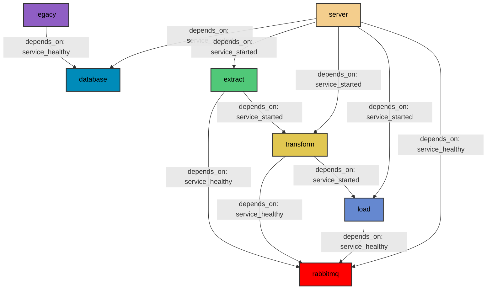

# Agriculture and Weather Dashboard

## How to build & run

```bash
  $ docker-compose up --build
```

- Once the build is complete, visit your application in the browser: http://localhost:8050 or http://127.0.0.1:8050


- This will launch your Docker services and open the application on port 8050

- You can visit http://localhost:15672 (username: guest, password:guest) to view the RabbitMQ management dashboard

- All requirements are handled by the respective Dockerfiles

## Project Structure

- ETL process has been broken down to three different microservices that communicate through RabbitMQ.
- Extract fetches data from the web or legacy files and enables Transform
- Transform is supposed to transform raw data and enable Load
- Load inputs the new data to the database


