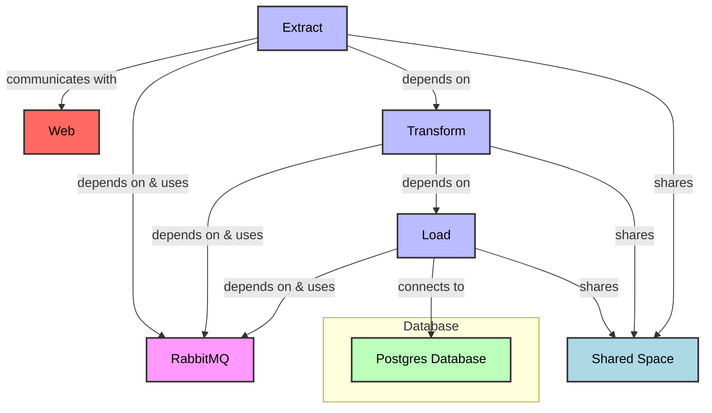

# Agriculture and Weather Dashboard

## How to run

```bash
  $ docker-compose up --build
  visit: localhost:8050
```

## Container Structure

- ETL process has been broken down to three different containers
- These containers communicate throught the RabbitMQ broker


