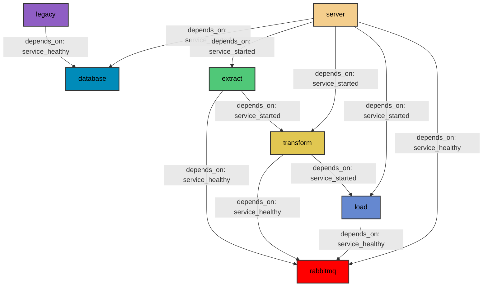

# Agriculture Dashboard

## How to build

```bash

$ docker-compose up --build

```

After building is over you can visit http://localhost:8050 to view our dashboard.

## Structure

Our Dashboard application consists of multiple microservices that communicate with each other. The architecture of our system is shown in the following figure. Each block represents a microservice (a Docker container that serves a purpose on our system). We can easily observe that the ETL process is broken down into three distinct microservices.



## Microservices

1. Database
    
    We use the PostgreSQL relational database management system, to host our database. PostgreSQL is a free and open-source project.
    
2. RabbitMQ
    
    RabbitMQ is an open-source message broker, that enables communication between microservices in our architecture. RabbitMQ creates a communication queue between two processes (services) allowing them to send and receive messages asynchronously. In our case, the exchanged messages are usually tasks assigned from one microservice to another. By visiting the <a href="http://localhost:15672/">local RabbitMQ Management Inteface</a> we can see more details and analytics about the communication of our microservices.

3. Legacy
    
    Legacy is one microservice that is only executed once on start-up. Since we use some legacy data that require specific handling (preprocessing, file combination etc) we created this microservice that loads said legacy data to our database.
    
4. Extract
    
    The Extract microservice is the main microservice of the ETL pipeline. A cronjob is running in that container every month (as of now the frequency of the cronjob is set on 10 minutes for testing purposes) checking whether the datasets we use have been updated. If the datasets have been updated it acquires the new data and enables the Transform microservice.
    
5. Transform
    
    When enabled, the Transform microservice preprocesses the new data, and the Load microservice is enabled.
    
6. Load
    
    When enabled, the Load microservice communicates with the Database and loads the new and processed data. Then, a message is sent to the Server for the Server to load the latest data from the Database.
    
7. Server
    
    Our server is built using the Dash Python framework, which in turn is built upon the Flask micro web framework. Our server starts when all used tables are present in the Database. Then the latest data are loaded and used. The utilized data are reloaded only when new data are available - that mechanism was implemented to reduce the number of times any formatting process was running. 
    