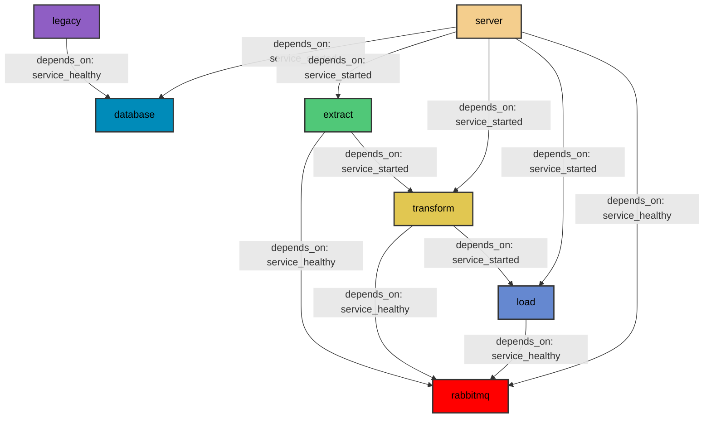

# Deployment Report

Our Dashboard application consists of multiple microservices that communicate with each other. The architecture of our system is shown in Figure []. Each block represents a microservice (a Docker container that serves a purpose on our system). We can easily observe that the ETL process is broken down into three distinct microservices.



## Microservices

1. Database
    
    We use the PostgreSQL relational database management system, to host our database. PostgreSQL is a free and open-source project.
    
2. RabbitMQ
    
    RabbitMQ is an open-source message broker, that enables communication between microservices in our architecture. RabbitMQ creates a communication queue between two processes (services) allowing them to send and receive messages asynchronously. In our case, the exchanged messages are usually tasks assigned from one microservice to another.
    
3. Legacy
    
    Legacy is one microservice that is only executed once on start-up. Since we use some legacy data that require specific handling (preprocessing, file combination etc) we created this microservice that loads said legacy data to our database.
    
4. Extract
    
    The Extract microservice is the main microservice of the ETL pipeline. A cronjob is running in that container every month checking whether the datasets we use have been updated. If the datasets have been updated it acquires the new data and enables the Transform microservice.
    
5. Transform
    
    When enabled, the Transform microservice preprocesses the new data, and the Load microservice is enabled.
    
6. Load
    
    When enabled, the Load microservice communicates with the Database and loads the new and processed data. Then, a message is sent to the Server for the Server to load the latest data from the Database.
    
7. Server
    
    Our server is built using the Dash Python framework, which in turn is built upon the Flask micro web framework. Our server starts when all used tables are present in the Database. Then the latest data are loaded and used. The utilized data are reloaded only when new data are available - that mechanism was implemented to reduce the number of times any formatting process was running. 
    

## Limitations

Our system is built to be resilient. The docker-compose file used assigns dependabilities that help our system to not crash. For example, all microservices that use RabbitMQ to communicate with each other will only start after it is up and healthy (the built-in rabbitmq-diagnostics method is used to determine health). All dependencies can be seen in Figure. In the case of Database health, our Database is considered healthy using the built-in ‘pg_isready’ method. For all our microservices we defined the necessary libraries alongside their versions.

One aspect that may limit, but not crash, the usage of our system is the discontinuation of our datasets. In that highly unlikely scenario, the system will not crash, however, the data will not get updated. However, all of our data sources (OpenMeteo, FAOSTAT, and CBS) are well-respected and reliable, thus any discontinuation of data does not seem likely. 

## Deployment

Our system can be easily deployed. The sole pre-requisite software is Docker Engine, which enables virtualization. If Docker Engine is installed, the system is constructed using the docker-compose up command with the build flag set. This command should be run in the directory containing the docker-compose.yml file, which is used to build our system.

```bash
$> docker-compose up --build
```

 The system is not so complex to require the use of Kubernetes or any other orchestration system. However, if in the future our system scales up dramatically, migrating to Kubernetes is possible.

## Maintenance

Reducing the required maintenance was one of the principles in mind when designing our system. We used microservices in order to have structured containers with as few responsibilities as possible. All microservices have a directory of their own, while also having a README file providing information when needed. Additionally, our code is documented allowing other developers to understand and maintain it.

### Data Sources

1. FAOSTAT
    
    The <a href=”https://pypi.org/project/faostat/”> official FAOSTAT Python library</a> was used to get up-to-date data regarding crop production.
    
2. CBS
    
    The <a href=”https://pypi.org/project/cbsodata/”> official CBS Python library</a> was used to get up-to-date data regarding crop production in specific provinces of the Netherlands.
    
3. OpenMeteo
    
    The <a href=”https://open-meteo.com/en/docs/historical-weather-api”> Historical Weather API</a> provided by OpenMeteo was used to get weather data for the Netherlands as a whole and for each province separately. 
    

### Python Libraries

Each microservice includes a requirements.txt file that lists which Python modules are installed and their versions. The files can be found in the Appendix. Another essential detail is that each microservice has a specific Python version installed. The base image for all ETL containers is python:3.9-slim, while the base image for the Server container is python:3.11.

### Training

No special training is necessary to utilize our system. A sophisticated logging feature has been developed, offering explanations of what is happening at all times. Our system is available via any web browser (<a href=”http://localhost:8050”> through port 8050</a>), and no prior knowledge or training is required to use it.